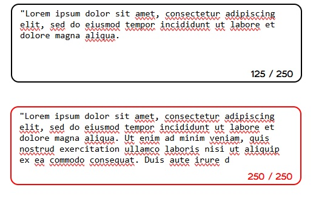

  <h1 align="center">
    Restricted Textarea
  </h1>

 

# Objective
create a textarea that tracks and displays the number of characters typed by the user, along with a maximum character limit. As the user types, the character count will update dynamically. Once the limit is reached, the textarea will prevent further input and the border will turn red to visually indicate the limit has been hit.
 
 

# README
https://roadmap.sh/projects/restricted-textarea
 
 

# PREVIEW

# EXTRA FEATURES
<ul>
  <li>Added regex code to exclude line breaks, for the user who likes line breaks to organize its writing.</li>
</ul>
 

# Auxiliary Resources
<ul>
  <li>
    <a href="https://www.w3schools.com/jsref/prop_node_textcontent.asp" alt="HTML DOM Element textContent">HTML DOM Element textContent</a>
  </li>
  <li>
    <a href="https://developer.mozilla.org/en-US/docs/Web/JavaScript/Guide/Regular_expressions" alt="Regex - Regular expressions">Regex - Regular expressions</a>
  </li>
  <li>
    <a href="https://www.w3schools.com/tags/tag_textarea.asp" alt="HTML <textarea> Tag">HTML <textarea> Tag</a>
  </li>
</ul>
